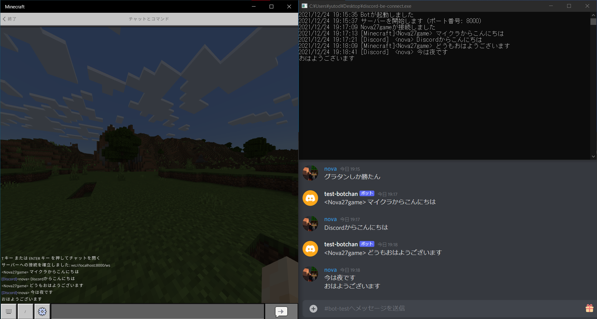

# DiscordBEConnect

Minecraft Bedrock Edition (統合版) と Discord のチャットを連携します

## デモ



## 機能

Minecraft で送信されたメッセージを Discord に、Discord に送信されたメッセージを Minecraft に転送します。

## 必要環境

- インターネット接続
- Windows または Linux
- Minecraft Bedrock Edition (`/connect`コマンドが実装されている)

## 使い方（Windows）

1. https://github.com/nova-27/DiscordBEConnect/releases から最新の exe をダウンロードします
2. ダブルクリックで実行すると黒画面（WS サーバー）が起動します
3. Minecraft で`/connect (サーバーのIPアドレス):8000/ws`コマンドを実行します

## 注意点

- オペレーター権限が必要です。
- Discord->Minecraft のメッセージ転送には内部的に`tellraw`コマンドが使用されます。
- WS サーバーを動かしている PC から接続（ループバック接続）する場合、コマンドプロンプト（管理者）で以下のコマンドを実行してください

```
CheckNetIsolation LoopbackExempt -a -n="Microsoft.MinecraftUWP_8wekyb3d8bbwe"
```

## 作者

[nova27](https://github.com/nova-27)

## ライセンス

[MIT license](https://en.wikipedia.org/wiki/MIT_License)

## 使用ライブラリ

- [DiscordGo](https://github.com/bwmarrin/discordgo)
- [mcwss](https://github.com/Sandertv/mcwss)
